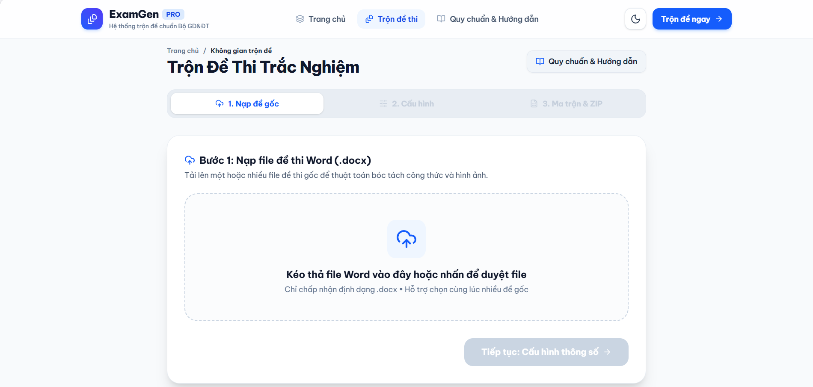
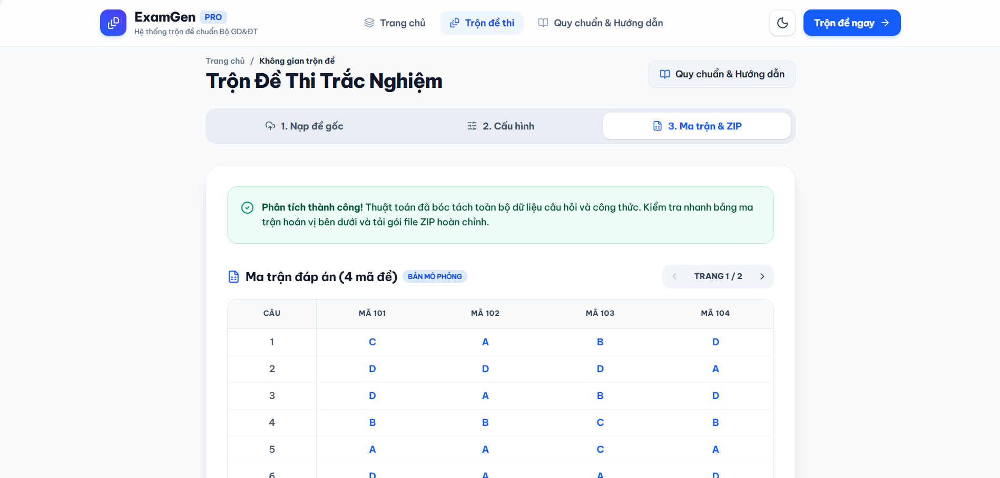
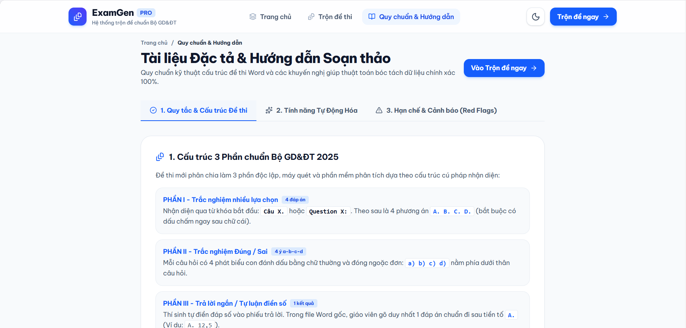

<div align="center">

  <h1>📝 ExamGen PRO - Smart Exam Generator Web</h1>
  <h3>Hệ thống Trộn Đề Thi Trắc Nghiệm Thông Minh Chuẩn Bộ GD&ĐT 2025</h3>

  <p>
    Giải pháp phần mềm hiện đại hỗ trợ giáo viên và cán bộ khảo thí tự động hóa quy trình xáo trộn đề thi từ file Word (.docx), 
    căn chỉnh dàn trang Smart Layout 4-2-1 thẳng hàng, bảo toàn 100% công thức Toán/Lý/Hóa và xuất ma trận đáp án Excel chấm thi chỉ trong vài giây.
  </p>

  <p>
    
    
    
    
    
  </p>

</div>

<br />

# 💻 FRONTEND USER DASHBOARD & WORKSPACE

Đây là Repository chứa mã nguồn **Frontend** của dự án **ExamGen PRO**, cung cấp giao diện trực quan, thẩm mỹ cao và trải nghiệm người dùng tối ưu dành cho giáo viên trên mọi thiết bị.

---

## 🛠️ Công nghệ & Phiên bản

Dự án được xây dựng trên nền tảng công nghệ mới nhất của hệ sinh thái React / Next.js:

### 🏗️ Core Stack

| Công nghệ | Phiên bản | Vai trò |
| :--- | :--- | :--- |
| **[Next.js](https://nextjs.org/)** | `16.2.6` | Framework React App Router, Server Components, tối ưu hóa Turbopack |
| **[React](https://react.dev/)** | `19.2.6` | Thư viện UI cốt lõi phiên bản React 19 mới nhất |
| **[react-dom](https://react.dev/learn/rendering-elements)** | `19.2.6` | Trình kết xuất DOM cho React 19 |

---

### 🎨 UI, Typography & Animation

| Công nghệ | Phiên bản | Vai trò |
| :--- | :--- | :--- |
| **[Tailwind CSS](https://tailwindcss.com/)** | `^4.0.0` | Framework Utility-first CSS thế hệ v4 với PostCSS `@tailwindcss/postcss` |
| **[Be Vietnam Pro](https://fonts.google.com/specimen/Be+Vietnam+Pro)** | `Google Font` | Bộ font chữ chuẩn hiển thị tiếng Việt hiện đại, tích hợp qua `next/font/google` |
| **[Lucide React](https://lucide.dev/)** | `^0.575.0` | Bộ biểu tượng SVG sắc nét, đồng bộ (nghiêm cấm sử dụng chat emoji) |
| **[Framer Motion](https://www.framer.com/motion/)** | `^14.0.0` | Thư viện xử lý animation, quầng sáng phát quang và hiệu ứng quét sáng (Shine Sweep) |
| **Custom Theme Engine** | `Tailwind Tokens` | Hỗ trợ chuyển đổi mượt mà Light Mode & Dark Mode với `localStorage` |

---

### 🌐 Networking & Data Communication

| Công nghệ | Cơ chế | Vai trò |
| :--- | :--- | :--- |
| **Native Fetch API** | `Multipart & Blob` | Giao tiếp REST API với Backend (Upload nhiều file `.docx`, nhận stream file `.zip`) |
| **FormData** | `Browser Native` | Đóng gói dữ liệu tệp nhị phân và tham số cấu hình hoán vị |

---

## 🌟 Tính năng Giao diện Nổi bật

### 1️⃣ Trang Chủ Giới Thiệu (Landing Page - `/`)
* **Huy hiệu Hero Badge sinh động:** Thiết kế phân tầng thông tin (Bộ GD&ĐT / Chính thức / Chuẩn 2025), tích hợp hiệu ứng quầng sáng Halo, hạt bụi trôi và vệt sáng quét ngang toàn màn hình.
* **Quy trình 3 bước trực quan:** Minh họa sinh động quá trình tạo đề thi chuẩn mực.
* **Lưới tính năng tiên tiến:** Trình bày chi tiết công nghệ Smart Layout 4-2-1, Round-Robin nhiều đề gốc, bảng ma trận Excel và tiêu đề tàng hình.
* **Tóm tắt quy ước & Cảnh báo Red Flags:** Giúp giáo viên nhanh chóng nắm bắt các quy tắc chuẩn hóa file Word.

### 2️⃣ Không Gian Trộn Đề Tinh Gọn (Wizard 3 Bước - `/generator`)
* **Bước 1 — Nạp đề gốc:** Khu vực kéo thả (Drag & Drop) thông minh, hiển thị danh sách các đề đã nạp, hỗ trợ xóa từng file hoặc bổ sung file linh hoạt.
* **Bước 2 — Cấu hình thông số & Tiêu đề:**
  * Bộ tham số hoán vị (Số lượng đề con kèm nút chọn nhanh `2`, `4`, `8`, `12` đề; Mã bắt đầu; Câu bắt đầu).
  * Tùy chọn bổ sung Header & Footer **mặc định là tắt**, chỉ mở rộng khi người dùng cần chèn thông tin trường/sở.
  * Tự động cuộn mượt mà lên đầu form (`scrollToFormTop`) khi chuyển bước.
  * Thẻ cảnh báo lỗi XML thông minh: Chỉ rõ tên file, vị trí câu lỗi, nội dung lỗi và hộp gợi ý khắc phục chi tiết (icon `Lightbulb`).
* **Bước 3 — Ma trận Đáp án & Tải ZIP:**
  * Bảng ma trận đối chiếu đáp án có phân trang (10 câu/trang), phát hiện câu nghi vấn `?` nổi bật.
  * Xem trước nội dung chi tiết mã đề đại diện (đáp án đúng được tô màu xanh lá chuẩn).
  * Tải trọn bộ file nén `.zip` chứa toàn bộ đề thi Word và file Excel ma trận.

### 3️⃣ Tài Liệu Đặc Tả & Hướng Dẫn Soạn Thảo (`/docs`)
* **Tab 1 — Cấu trúc 3 Phần chuẩn Bộ 2025:** Hướng dẫn định dạng Phần I (Trắc nghiệm 4 lựa chọn), Phần II (Đúng/Sai 4 ý a-b-c-d), Phần III (Trả lời ngắn).
* **Tab 2 — Cách đánh dấu đáp án đúng:** Hướng dẫn bôi màu chữ (Đỏ, Xanh lá, Xanh dương) hoặc gạch chân (`Ctrl + U`).
* **Tab 3 — Phân nhóm `<g0>` - `<g3>` & Ghim `#`:** Khóa câu đọc hiểu, bài nghe hoặc ghim cố định đáp án *"Tất cả đều đúng"*.
* **Tab 4 — Vùng Cảnh Báo (Red Flags):** Cấm dùng Table/Textbox cho câu hỏi, ảnh bắt buộc đặt *In line with text*, tuyệt đối không dùng phím Enter ngắt dòng bên trong đáp án.

---

## 📸 Demo Giao diện

### 1. Trang Chủ Giới Thiệu (Landing Page)


### 2. Không Gian Trộn Đề (3-Step Wizard)


### 3. Ma Trận Đáp Án & Đề Thi Mô Phỏng


### 4. Tài Liệu Hướng Dẫn & Quy Chuẩn Bộ GD 2025


---

## 🚀 Cài đặt & Khởi chạy

### 1️⃣ Yêu cầu hệ thống (Prerequisites)

* **Node.js:** `>= 18.18.0` (Khuyến nghị **Node.js 20.x** hoặc **22.x LTS**)
* **Package Manager:** `npm` (>= 9), `yarn`, `pnpm` hoặc `bun`

### 2️⃣ Clone Repository & Cài đặt Dependencies

```bash
git clone https://github.com/hvt299/Exam-Generator-Web.git
cd Exam-Generator-Web
npm install
```

### 3️⃣ Cấu hình biến môi trường (.env)

Tạo file `.env` hoặc `.env.local` tại thư mục gốc của dự án:

```env
# Địa chỉ API của Backend Service
NEXT_PUBLIC_API_URL=http://localhost:3001
```

> **Lưu ý:** Nếu chạy môi trường Production, thay đổi `NEXT_PUBLIC_API_URL` thành địa chỉ server backend đã deploy của bạn.

### 4️⃣ Các lệnh thực thi (NPM Scripts)

```bash
# Khởi chạy môi trường phát triển (Dev Server tại port 3000 với Turbopack)
npm run dev

# Biên dịch tối ưu hóa production build
npm run build

# Khởi chạy bản production sau khi build
npm run start

# Kiểm tra cú pháp và quy chuẩn mã nguồn (ESLint)
npm run lint
```

Sau khi khởi chạy thành công, truy cập trình duyệt tại:
```text
http://localhost:3000
```

---

## 📂 Cấu trúc Thư mục Dự án

```text
Exam-Generator-Web/
├── app/
│   ├── docs/
│   │   └── page.tsx           # Trang Quy chuẩn & Hướng dẫn đặc tả Bộ GD 2025
│   ├── generator/
│   │   └── page.tsx           # Không gian làm việc Trộn đề (Wizard 3 Bước)
│   ├── globals.css            # Design Tokens màu sắc Light/Dark, Keyframes Animation
│   ├── layout.tsx             # Root layout cấu hình Font Be Vietnam Pro, ThemeProvider
│   └── page.tsx               # Trang chủ Landing Page giới thiệu hệ thống
├── components/
│   ├── Footer.tsx             # Chân trang chuẩn hóa thông tin và điều hướng
│   ├── Header.tsx             # Thanh điều hướng sticky, logo ExamGen PRO, Drawer Mobile
│   ├── HeroBadge.tsx          # Huy hiệu animated chuẩn Bộ GD&ĐT 2025 (Framer Motion)
│   ├── ThemeProvider.tsx      # Quản lý trạng thái Light/Dark mode và lưu localStorage
│   └── ThemeToggle.tsx        # Nút chuyển đổi Light/Dark mode (Lucide Sun/Moon icon)
├── public/
│   ├── demo/                  # Ảnh chụp màn hình demo giao diện
│   └── ...                    # Các tài nguyên tĩnh SVG
├── package.json
└── tsconfig.json
```

---

## 🔗 Kết nối Backend

Frontend này hoạt động tương tác với **ExamGen PRO Backend API** (mặc định tại cổng `3001`):
* `POST /api/v1/exams/preview`: Phân tích bóc tách đề thi, trả về ma trận đối chiếu và danh sách câu hỏi mô phỏng.
* `POST /api/v1/exams/mix-multi`: Hoán vị câu hỏi, áp dụng Smart Layout, đóng gói và tải về file `.zip` hoàn chỉnh.

---

## 👨‍💻 Tác giả

Phát triển bởi **Mr.T (hvt299)**  
GitHub: [https://github.com/hvt299](https://github.com/hvt299)
